<p align="center">
  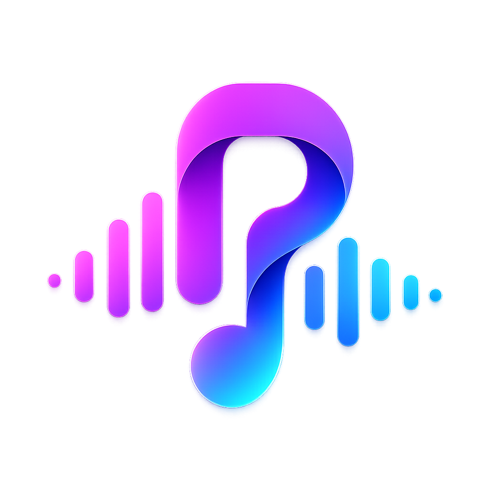
</p>

<h1 align="center">RiftWave Music 🎧</h1>

<p align="center">
  <strong>An open-source, beautifully designed, and highly optimized music streaming app.</strong><br>
  No ads. No tracking. No accounts. Just pure music.
</p>

<p align="center">
  <a href="https://flutter.dev"></a>
  <a href="https://github.com/Pratyush0803/RiftWave-Music/releases"></a>
  <a href="LICENSE"></a>
</p>

<hr>

## ✨ Features

- 🎵 **Ad-Free Streaming**: Seamless, uninterrupted audio streaming pulling from high-quality sources.
- 🎨 **Sleek UI & Dynamic Theming**: Beautiful, fully customizable interface featuring true black (AMOLED) and sleek dark modes.
- 📥 **Offline Downloads**: Download your favorite tracks and play them anywhere, anytime.
- 🎬 **Music Videos**: Watch music videos natively integrated directly within the player.
- 📂 **Local Storage**: All history, favorites, and settings stay completely on your device.
- 📝 **Live Lyrics**: Follow along with synced lyrics support.
- 🔁 **Continuous Playback**: Background play, lock-screen controls, and gapless support.
- 🚀 **Cross-Platform**: Available for Android (APK), and fully capable on Windows and Linux!

---

## 📸 Screenshots

Here is a glimpse into the beautiful design and experience of RiftWave Music:

<p align="center">
  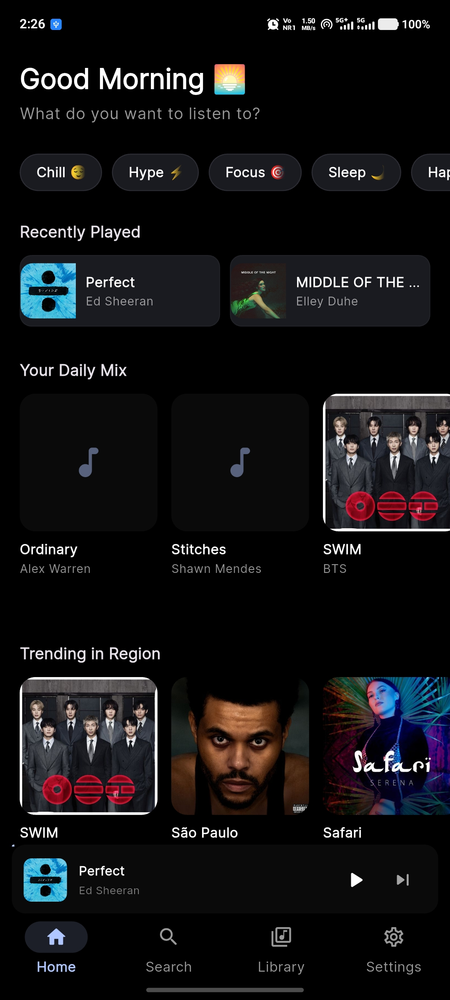
  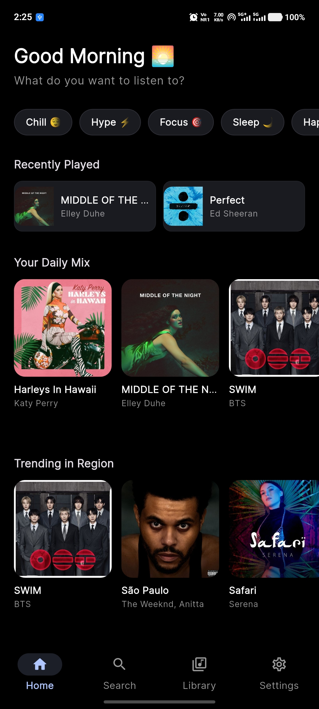
  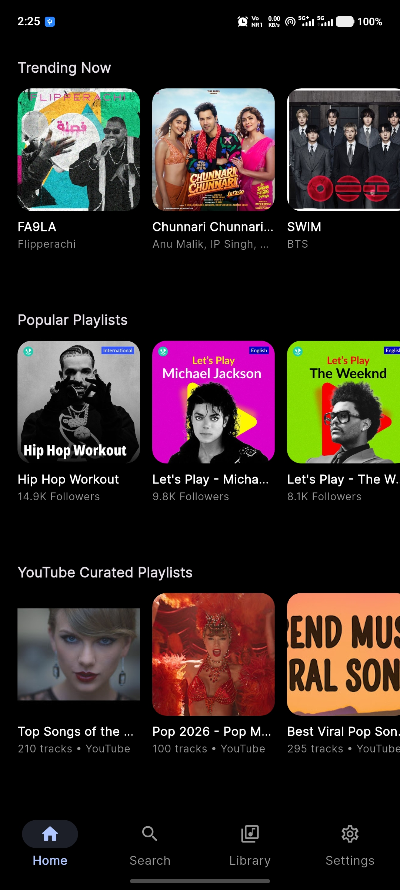
</p>
<p align="center">
  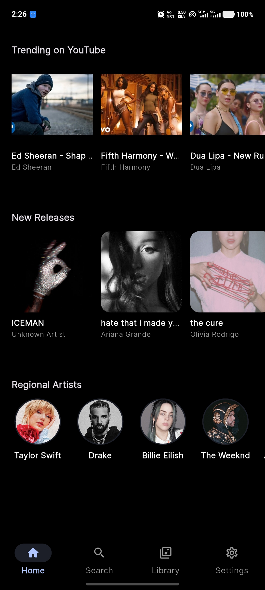
  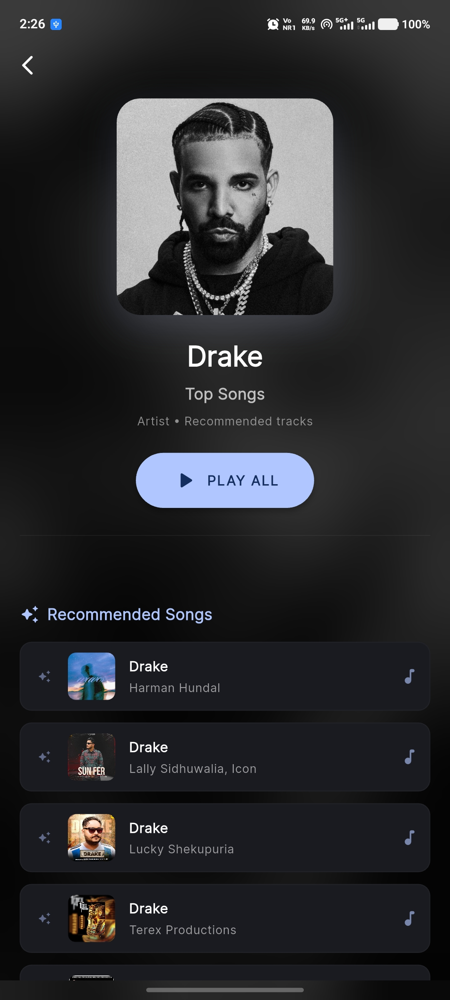
  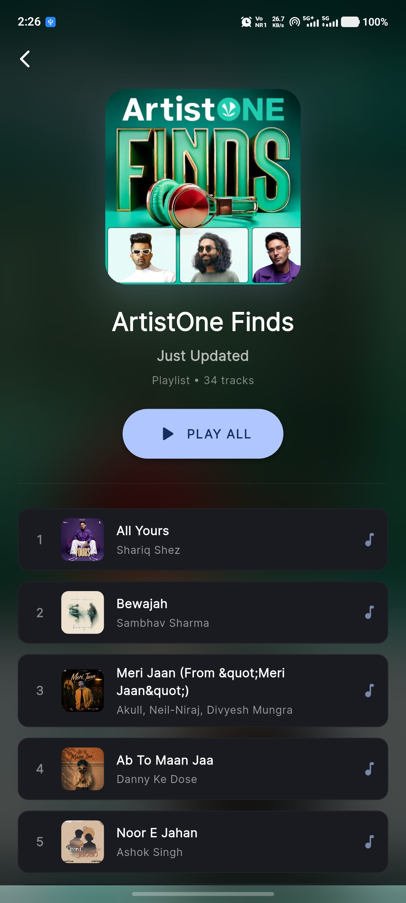
</p>

<details>
<summary><b>View More Screenshots</b></summary>
<br>

<p align="center">
  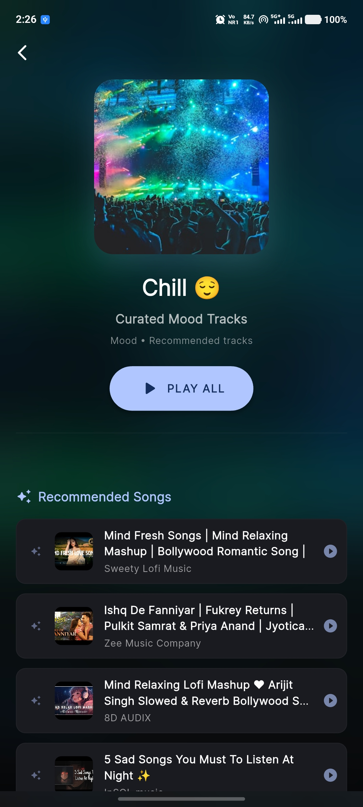
  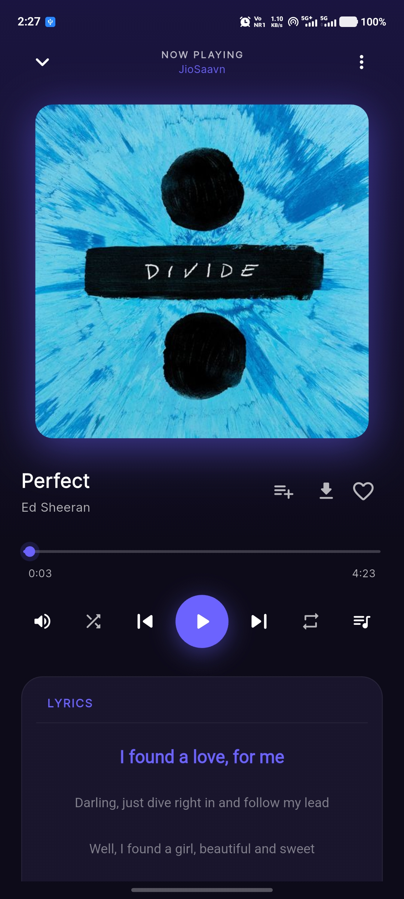
  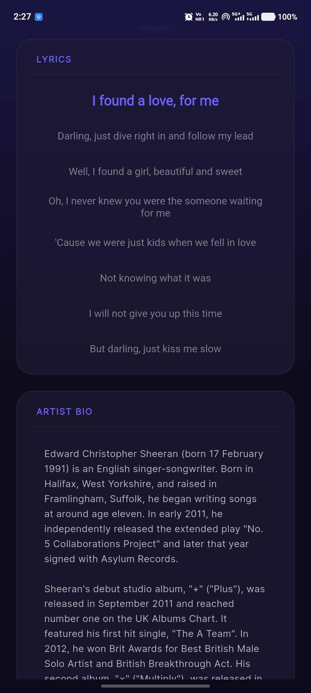
</p>
<p align="center">
  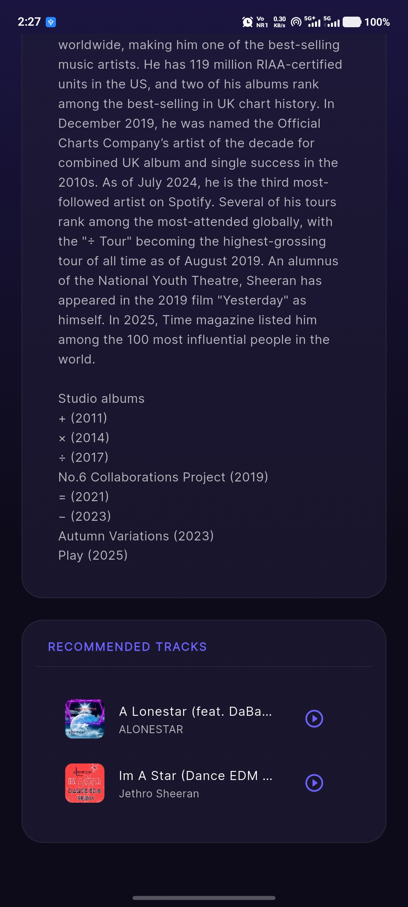
  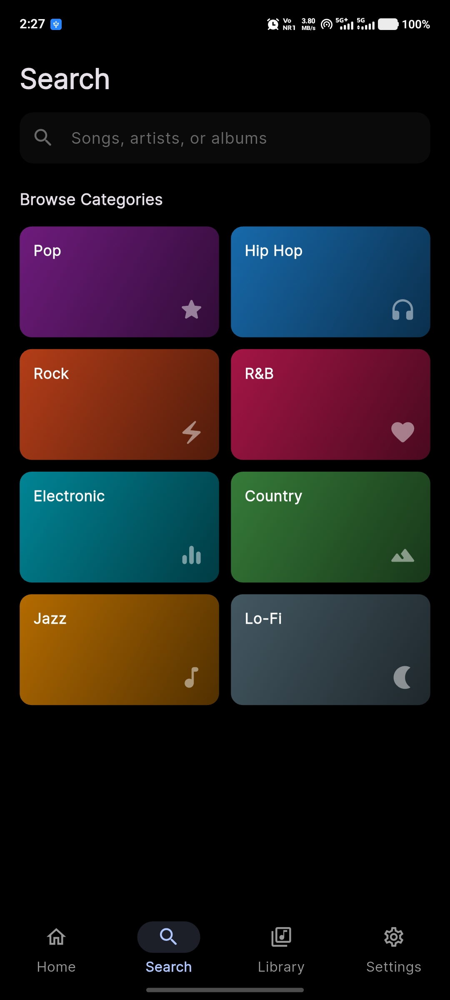
  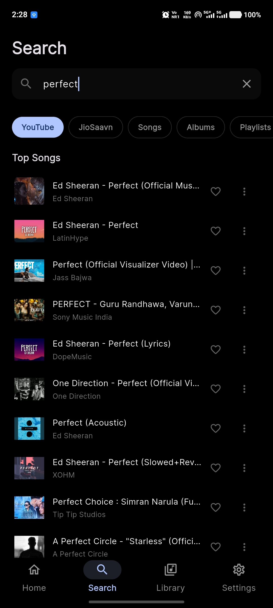
</p>
<p align="center">
  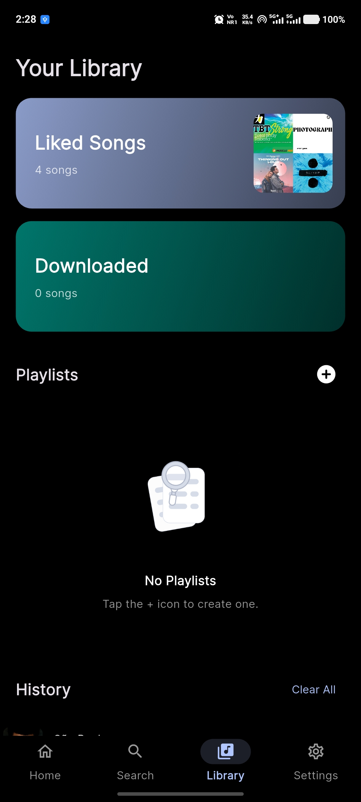
  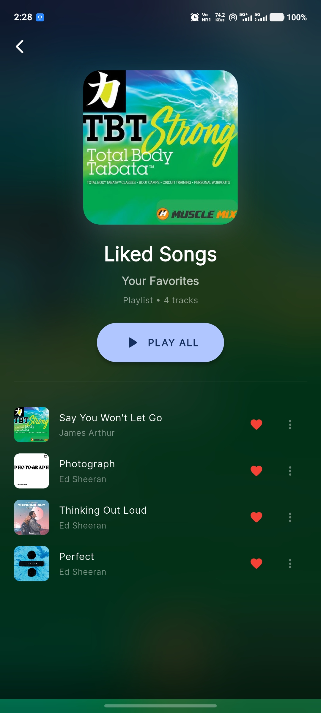
  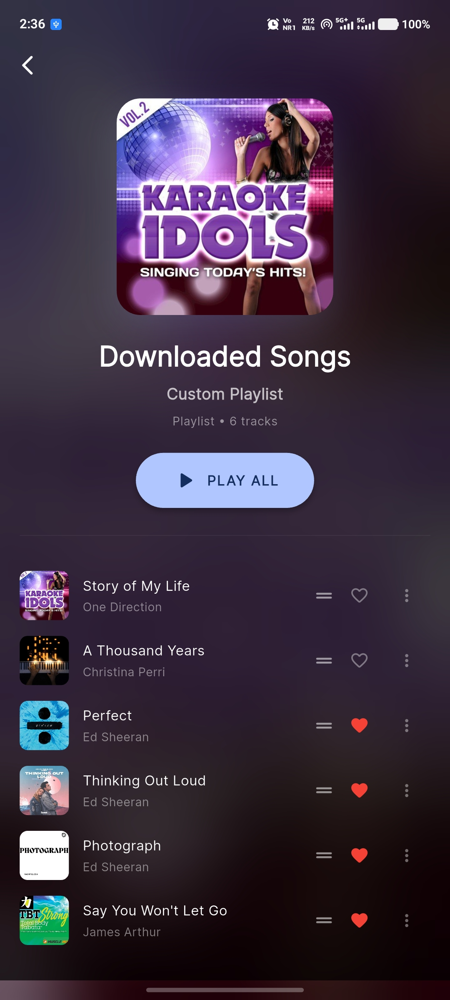
</p>
<p align="center">
  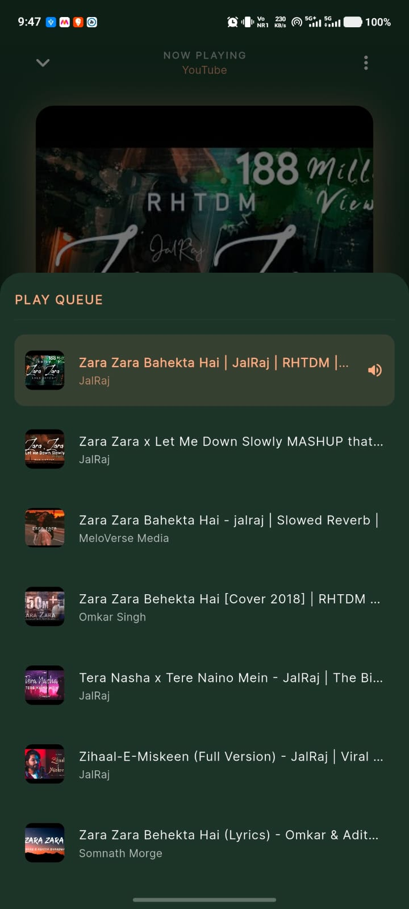
  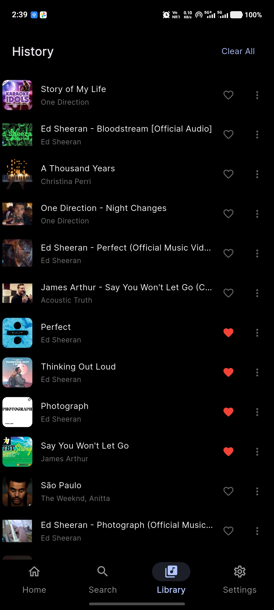
  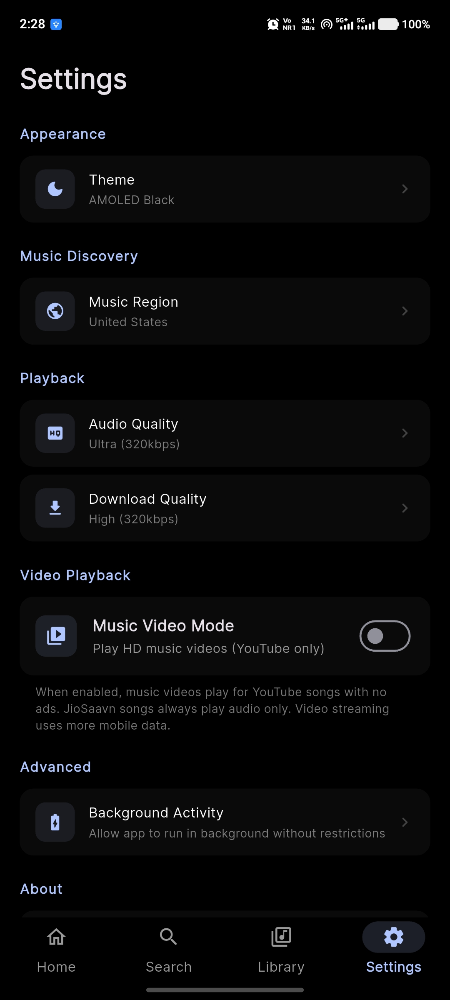
</p>

</details>

---

## 📥 Installation

### Android
1. Go to the [Releases](https://github.com/Pratyush0803/RiftWave-Music/releases) page.
2. Download the latest `app-release.apk` file.
3. Install the APK on your device (you may need to enable "Install from unknown sources" in your settings).

### Windows / Linux / macOS
RiftWave supports desktop platforms out of the box using Flutter's native desktop rendering.
Currently, desktop builds are compiled locally. See **Building from Source** below.

---

## 🛠 Building from Source

To build and run RiftWave yourself, you need to have [Flutter](https://flutter.dev/docs/get-started/install) installed.

1. **Clone the repository:**
   ```bash
   git clone https://github.com/Pratyush0803/RiftWave-Music.git
   cd RiftWave-Music
   ```

2. **Fetch dependencies:**
   ```bash
   flutter pub get
   ```

3. **Run the app:**
   ```bash
   flutter run
   ```

4. **Build APK for Android:**
   ```bash
   flutter build apk --release
   ```

---

## 🔒 Privacy Policy

RiftWave Music is entirely open-source and respects your privacy.
- **No Telemetry**: We do not collect any usage data, analytics, or crash reports.
- **No Accounts**: The app works out of the box completely anonymously.
- **Local Storage**: Your search history, playlists, and settings are saved locally on your device. We do not have access to them.
- **APIs**: The app fetches audio data and metadata directly from third-party APIs (like YouTube and JioSaavn). Those standard network requests are the only external connections made by the app.

---

## 🤝 Contributing

Contributions, issues, and feature requests are always welcome! Feel free to check out the [Issues](https://github.com/Pratyush0803/RiftWave-Music/issues) page if you'd like to help improve RiftWave.

## 📄 License

This project is licensed under the GPL-3.0 License. See the [LICENSE](LICENSE) file for details.

<br>
<p align="center">
  Made with ❤️ by <a href="https://github.com/Pratyush0803">Pratyush0803</a>
</p>
