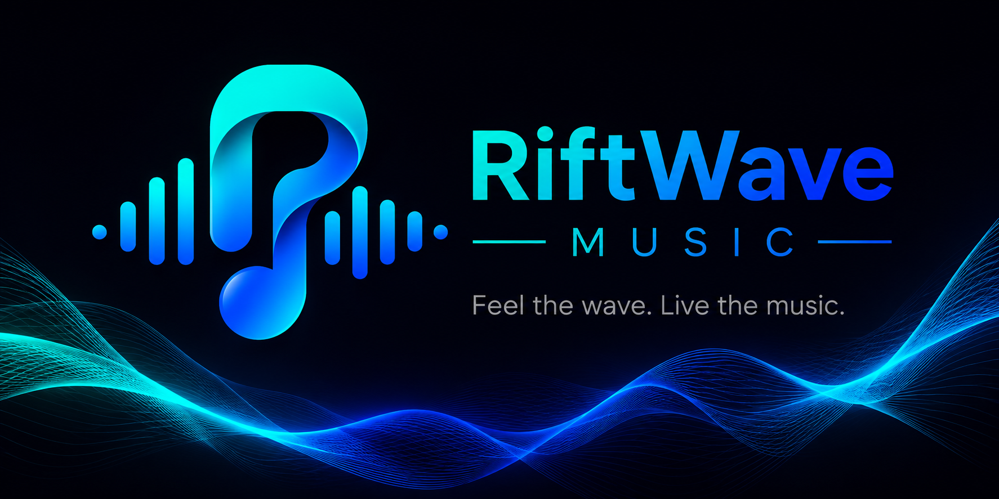

<div align="center">



# RiftWave Music
**An open-source, beautifully designed, and highly optimized music streaming app.**  
*No ads. No tracking. No accounts. Just pure music.*

[](https://flutter.dev)
[](https://github.com/Pratyush0803/RiftWave-Music/releases)
[](LICENSE)
[](https://github.com/Pratyush0803/RiftWave-Music/stargazers)

[**Download**](#-download) • [**Features**](#-features) • [**Screenshots**](#-screenshots) • [**Installation**](#-installation) • [**Privacy**](#-privacy-policy)

</div>

---

## 🎵 About

**RiftWave Music** is a sleek, completely free, and open-source music streaming application built using Flutter. It aims to provide a premium music streaming experience without the clutter of ads, the intrusion of trackers, or the friction of account sign-ups.

Powered by robust APIs behind the scenes (such as YouTube and JioSaavn), RiftWave delivers high-quality audio, synced lyrics, and native music video playback directly to your device.

---

## ✨ Features

- 🚫 **Ad-Free Experience:** Uninterrupted listening, forever.
- 🎨 **Material You & Dynamic Theming:** Beautiful UI that adapts to your device's wallpaper, featuring True Black (AMOLED) and sleek dark modes.
- 📥 **Offline Downloads:** Cache and download your favorite tracks directly to your local storage to listen anywhere, anytime.
- 🎬 **Music Video Mode (Beta):** Watch HD music videos natively integrated directly within the player.
- 📝 **Live Synced Lyrics:** Follow along with your favorite songs using real-time synchronized lyrics.
- 🔁 **Gapless Playback:** Seamless transition between tracks for the perfect album listening experience.
- 📱 **Cross-Platform Support:** Available for Android, Windows, Linux, and macOS.
- 🔒 **Privacy First:** Your data stays on your device. No telemetry, no usage tracking, no cloud accounts.
- 📻 **Smart Recommendations:** Auto-play similar tracks to keep the music going based on your listening history.
- 🎛️ **Audio Controls:** Lock-screen controls, background playback, and system media integration.

---

## 📸 Screenshots

Here is a glimpse into the beautiful design and experience of RiftWave Music:

<p align="center">
  
  
  
</p>
<p align="center">
  
  
  
</p>

<details>
<summary><b>🔥 Click to view more screenshots</b></summary>
<br>

<p align="center">
  
  
  
</p>
<p align="center">
  
  
  
</p>
<p align="center">
  
  
  
</p>
<p align="center">
  
  
  
</p>

</details>

---

## 📥 Download

Grab the latest version of RiftWave Music from the [Releases](https://github.com/Pratyush0803/RiftWave-Music/releases) page!

- **Android:** Download the `.apk` file (`app-arm64-v8a-release.apk` recommended for most modern phones).
- **Windows:** Download the `.zip` file, extract it, and run `riftwave_music.exe`.
- **Linux:** Download the `.tar.gz` bundle.
- **macOS:** Download the `.zip` bundle.

---

## 🛠 Installation (Android)

1. Go to the [Releases](https://github.com/Pratyush0803/RiftWave-Music/releases) page.
2. Download the latest `app-release.apk` file.
3. Open the downloaded file. You may be prompted to allow **"Install from unknown sources"**.
4. Enable the permission, complete the installation, and enjoy the music!

---

## 👨‍💻 Building from Source

If you want to compile the application yourself or contribute to the development, follow these steps:

### Prerequisites
- Install [Flutter](https://flutter.dev/docs/get-started/install) (Ensure it's added to your system PATH).
- Install Android Studio (for Android builds) or Visual Studio (for Windows builds).

### Steps
1. **Clone the repository:**
   ```bash
   git clone https://github.com/Pratyush0803/RiftWave-Music.git
   cd RiftWave-Music
   ```

2. **Install dependencies:**
   ```bash
   flutter pub get
   ```

3. **Run the app (Debug Mode):**
   ```bash
   flutter run
   ```

4. **Build a Release APK:**
   ```bash
   flutter build apk --release --split-per-abi
   ```

---

## 🔒 Privacy Policy

RiftWave Music respects your privacy. We believe your data belongs to you.
- **No Telemetry**: We do not collect any usage data, analytics, or crash reports.
- **No Accounts**: The app works out of the box anonymously.
- **Local Storage**: Your search history, library, downloads, and settings are saved purely on your device's local storage using Hive.
- **API Requests**: The app fetches audio streams and metadata directly from third-party APIs (like YouTube via `youtube_explode_dart` and JioSaavn). These standard network requests are the only external connections made.

---

## 🤝 Contributing

Contributions are what make the open-source community such an amazing place to learn, inspire, and create. Any contributions you make are **greatly appreciated**.

1. Fork the Project
2. Create your Feature Branch (`git checkout -b feature/AmazingFeature`)
3. Commit your Changes (`git commit -m 'Add some AmazingFeature'`)
4. Push to the Branch (`git push origin feature/AmazingFeature`)
5. Open a Pull Request

---

## 📄 License

Distributed under the GPL-3.0 License. See `LICENSE` for more information.

---

<p align="center">
  Made with ❤️ by <a href="https://github.com/Pratyush0803">Pratyush0803</a>
</p>
